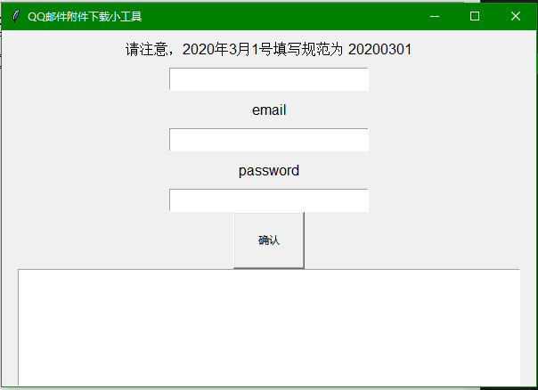

## QQ邮箱附件下载小工具

### 背景
女票有一个日常工作为收集同学们青年大学习学习情况截图的工作，因为一个一个从邮箱上点击下载会耗费不少的时间，所以为了节约这个时间，我写了这个QQ邮箱附件下载小工具。
为了方便使用，我写了一个简易的GUI界面。具体如下：

### 功能
主要功能为获取自填写的日期起至当前时间邮箱内所有邮件的附件。

#### 输入介绍
输入总共有三：
一）日期，这个日期为一个限制条件，本工具会从此日期开始爬到当前日期。

二）email账号，注意本工具只支持qq邮箱，若想爬取其他邮箱，需将源代码中的pop服务器参数进行调整。

三）password，注意这里的密码指的并不是qq邮箱登录密码，而是pop3登录的专用密码，在qq邮箱的设置里获得这个专用密码，如不清楚请自行百度。

#### 输出
本程序会自动在程序所在目录创建一个attachment文件夹，然后会把爬下来的内容放到这个attachment文件夹中。